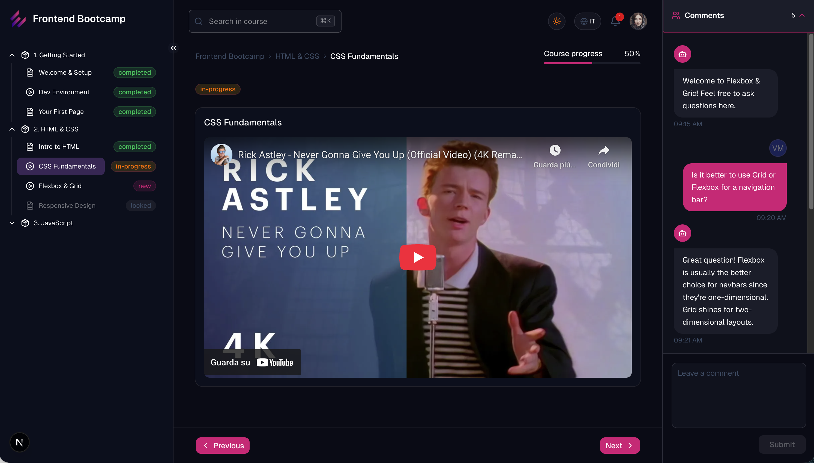

# EPICODE LMS — Design System & UI

> Take-home challenge for the **Senior Frontend Developer** position at EPICODE.

## Quick Start

```bash
pnpm install
pnpm dev            # Next.js app → http://localhost:3000
pnpm storybook      # Storybook  → http://localhost:6006
```

## Available Scripts

| Script | Description |
|--------|-------------|
| `pnpm dev` | Start the LMS web app (Next.js + Turbopack) |
| `pnpm build` | Build all apps & packages |
| `pnpm test` | Run all tests (Vitest) |
| `pnpm lint` | Lint all packages (ESLint) |
| `pnpm check-types` | TypeScript type checking |
| `pnpm format` | Fix formatting (Ultracite/Biome) |
| `pnpm format:check` | Check formatting (0 errors required) |
| `pnpm storybook` | Start Storybook dev server |
| `pnpm storybook:build` | Build Storybook to static |

## Monorepo Structure

```
├── apps/
│   ├── web/                 # Next.js 16 — LMS UI
│   └── storybook/           # Storybook 8
├── packages/
│   ├── ui/                  # ⛔ Untouched shadcn/ui primitives
│   ├── design-system/       # ✅ EPICODE-branded component library
│   ├── eslint-config/       # Shared ESLint configuration
│   └── typescript-config/   # Shared TypeScript configs
├── turbo.json
├── biome.jsonc
└── package.json
```

## Architecture Decisions

### App Router & Server Components

The LMS app uses Next.js **App Router** with a route group `(lms)` to keep the layout structure clean. Pages are React Server Components by default — only components that need browser APIs or state (`chat-aside`, `theme-switcher`, `language-switcher`) are marked `"use client"`. This minimizes the client bundle and lets the lesson page fetch data and translations on the server with zero hydration overhead.

### Design System Components (12)

| Component | Base | What it adds |
|-----------|------|-------------|
| `DsButton` | Button | EPICODE color variants, loading state, icon slot |
| `DsCard` | Card | Lesson card styling, progress indicator slot |
| `DsSidebar` | Sidebar | Collapsible, nested tree support, active state |
| `DsTreeItem` | custom | Recursive tree node (module → lesson), status indicators |
| `DsAvatar` | Avatar | Branded fallback, online status ring |
| `DsProgress` | Progress | EPICODE colors, label, percentage text |
| `DsBadge` | Badge | Status variants: completed, in-progress, locked, new |
| `DsInput` | Input | Branded focus ring, error state, helper text |
| `DsDialog` | Dialog | Branded header, consistent spacing |
| `DsTooltip` | Tooltip | EPICODE styled with brand colors |
| `DsChatBubble` | custom | AI chat bubbles — user vs assistant variants |
| `DsChatInput` | custom | Message input with send button |

Each component has:
- Full Storybook story with interactive controls and autodocs
- Colocated test file (`*.test.tsx`) with Vitest + Testing Library
- JSDoc documentation

### LMS Demo



### Brand Fidelity

- **Primary (Pink):** `oklch(0.5693 0.2314 358.22)`
- **Dark (Bunting):** `oklch(0.2753 0.0942 272.09)`
- Colors defined as CSS custom properties via Tailwind CSS v4 `@theme` in oklch color space
- Light theme is the default; dark theme is fully supported via `next-themes`

### LMS Layout — Three-Panel Design

The web app implements the reference `ui.png` layout:

- **Left — Course Navigation:** Collapsible sidebar built with `DsSidebar` + `DsTreeItem`. Nested tree structure (Course → Module → Lesson) with completion badges, active state highlighting, and keyboard navigation.
- **Center — Lesson Content:** Breadcrumb navigation, progress bar, lesson content rendered as Markdown with `react-markdown` + `@tailwindcss/typography`, and prev/next navigation.
- **Right — AI Chat Panel:** Collapsible chat aside with `DsChatBubble` + `DsChatInput`, mocked conversation history.

### Server Components First

The app leverages React Server Components by default. Only components that require client-side interactivity (`"use client"`) are explicitly marked:
- `chat-aside.tsx` — manages chat state
- `theme-switcher.tsx` — reads theme from `next-themes`
- `language-switcher.tsx` — triggers locale cookie update
- `DsTreeItem`, `DsChatInput` — interactive DS components

### Internal DS Cross-Imports

Components within `design-system` that import other DS components (e.g., `DsChatBubble` → `DsAvatar`) use the package path alias `@workspace/design-system/components/ds-*`. This is the only pattern that works reliably in both Turbopack dev and webpack production builds with `moduleResolution: "NodeNext"`.

### Tradeoffs & Assumptions

The reference `ui.png` focuses on the three-panel layout but doesn't show a detailed lesson page. Elements like the **breadcrumb bar**, **progress indicator**, **status badges**, and **prev/next navigation** were designed from scratch to showcase more DS components in a realistic context. The same applies to the placement and styling of `DsProgress` and `DsBadge` within the content area — they follow common LMS conventions rather than a pixel-perfect spec.

## Implemented Bonus Features

- **Dark Mode** — Full dark theme support with `next-themes`, toggle in header
- **i18n** — English/Italian via `next-intl` with cookie-based locale persistence and server actions. Language switcher in header.
- **Pre-commit Hooks** — Husky configured for formatting checks
- **Responsive Sidebar** — Collapsible with smooth transitions
- **Keyboard Navigation** — Tree items navigable via keyboard